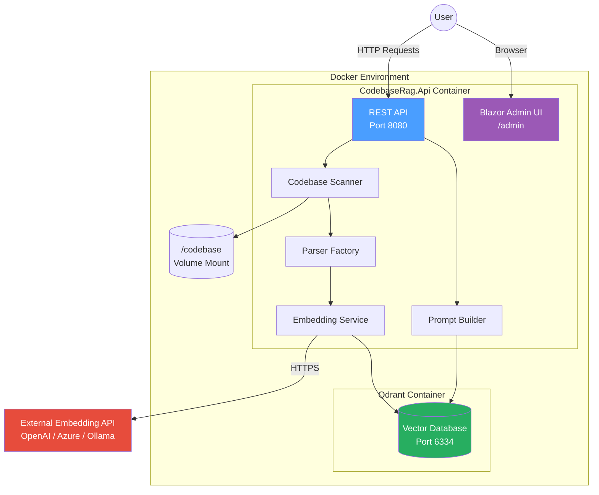
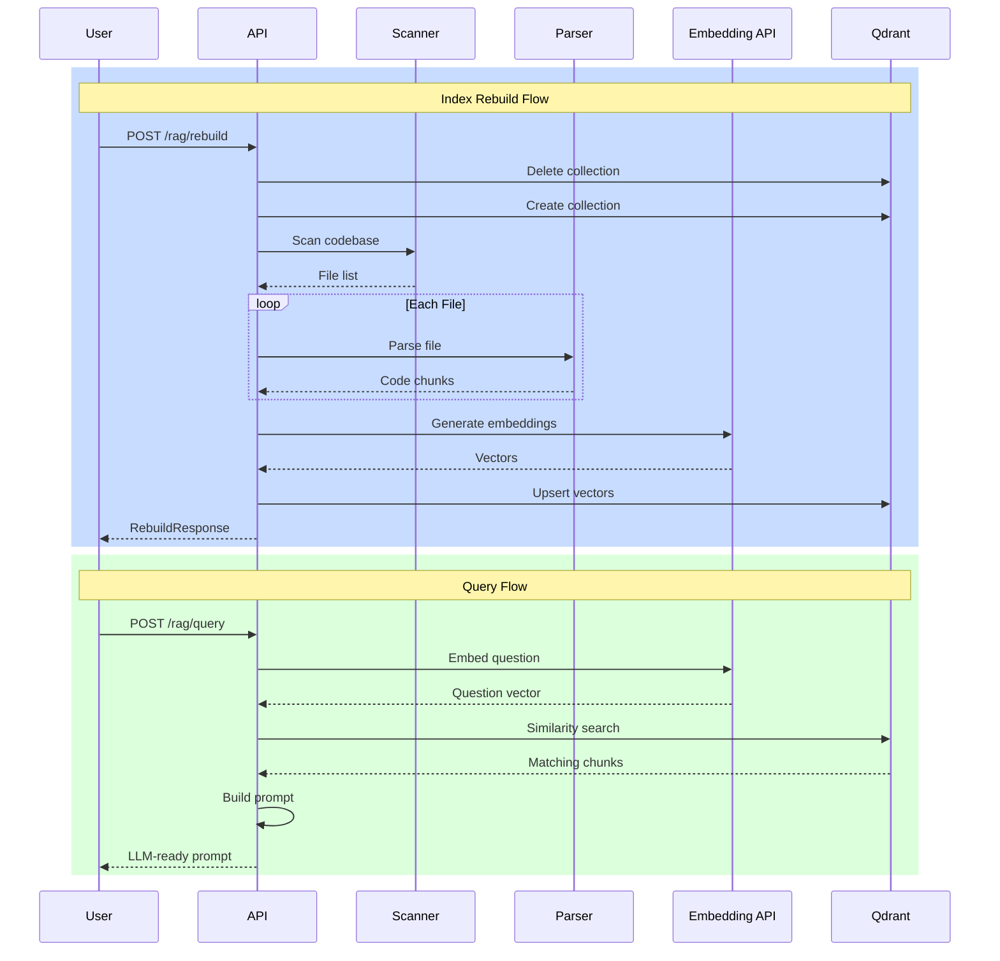

# Codebase RAG - Documentation

A Retrieval-Augmented Generation (RAG) system for codebase indexing and semantic search.

## Quick Navigation

| Document | Description |
|----------|-------------|
| [Architecture](./architecture.md) | System architecture and component overview |
| [Data Flow](./data-flow.md) | How data moves through the system |
| [Components](./components.md) | Detailed component documentation |

---

## System Overview



---

## Core Workflow



---

## Technology Stack

| Layer | Technology | Purpose |
|-------|------------|---------|
| **Runtime** | .NET 8 | Core framework |
| **API** | ASP.NET Core | REST endpoints |
| **Admin UI** | Blazor Server | Real-time web interface |
| **Parsing** | Roslyn | C# syntax analysis |
| **Vector Store** | Qdrant 1.7.4 | Semantic search |
| **Embedding** | OpenAI API | Text-to-vector conversion |
| **Container** | Docker | Deployment |

---

## Getting Started

```bash
# 1. Clone and configure
cp .env.example .env
# Edit .env with your EMBEDDING_API_KEY

# 2. Start services
docker-compose up -d

# 3. Rebuild index
curl -X POST http://localhost:5000/rag/rebuild

# 4. Query codebase
curl -X POST http://localhost:5000/rag/query \
  -H "Content-Type: application/json" \
  -d '{"question": "How does authentication work?"}'
```

---

## Project Structure

```
poc-codebase-rag/
├── src/CodebaseRag.Api/     # Main application
│   ├── Configuration/       # Settings classes
│   ├── Contracts/           # Request/Response models
│   ├── Endpoints/           # API route handlers
│   ├── Services/            # Core business logic
│   ├── Parsing/             # Code parsers
│   └── Components/          # Blazor UI
├── docs/                    # Documentation
├── sample-codebase/         # Test files
├── docker-compose.yml       # Container orchestration
└── Dockerfile               # Build configuration
```
