# Architecture Overview

## Container Architecture

---

## Service Layer Architecture

---

## Parser Selection Strategy

---

## Dependency Injection Graph

---

## Vector Database Schema

---

## Blazor Admin UI Structure

---

## Configuration Hierarchy

```mermaid
flowchart TB
    subgraph "Priority (Low to High)"
        direction TB
        A[appsettings.json<br/>Default values]
        B[appsettings.Development.json<br/>Environment overrides]
        C[Environment Variables<br/>Docker/Runtime]
        D[ConfigurationManager<br/>Runtime changes]
    end

    A --> B --> C --> D

    D --> FINAL[Final Configuration<br/>RagSettings]

    subgraph "RagSettings Sections"
        FINAL --> CB[Codebase<br/>RootPath, Excludes]
        FINAL --> EM[Embedding<br/>API, Model, Key]
        FINAL --> CH[Chunking<br/>Size, Overlap]
        FINAL --> VS[VectorStore<br/>Host, Port]
        FINAL --> PR[Prompt<br/>MaxChunks, Tokens]
        FINAL --> PM[ParserMapping<br/>Extension → Parser]
    end

    style A fill:#bdc3c7
    style B fill:#95a5a6
    style C fill:#7f8c8d
    style D fill:#2c3e50,color:#fff
    style FINAL fill:#27ae60,color:#fff
```

---

## Health Check Flow

---

## Docker Build Stages

