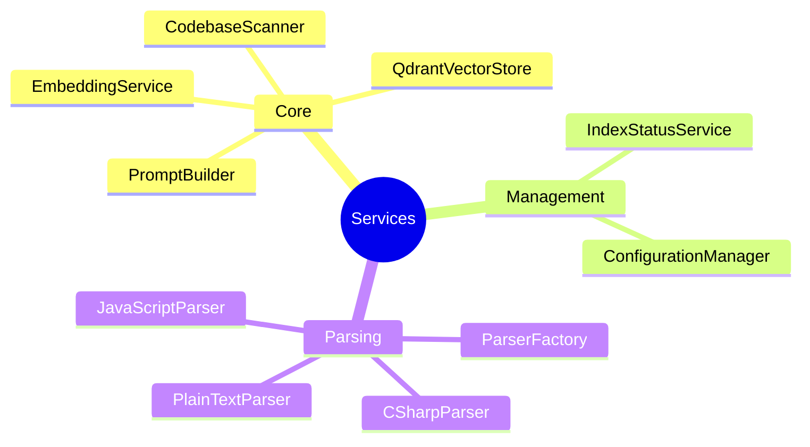
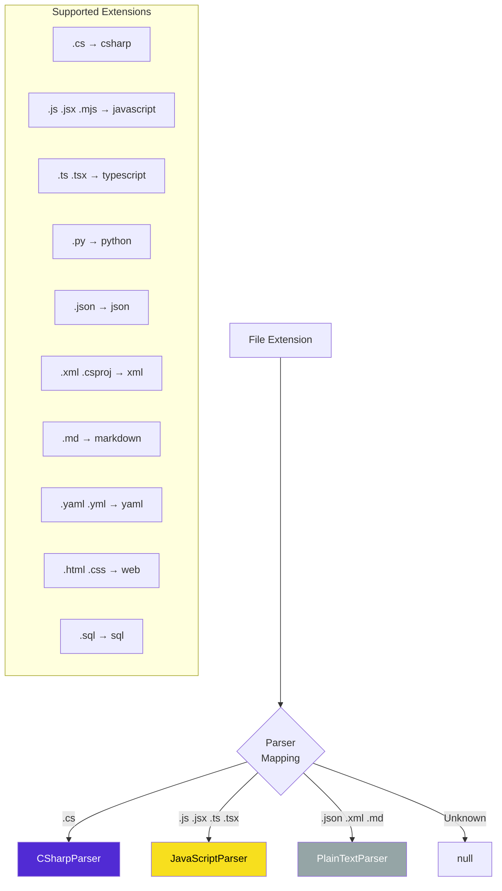
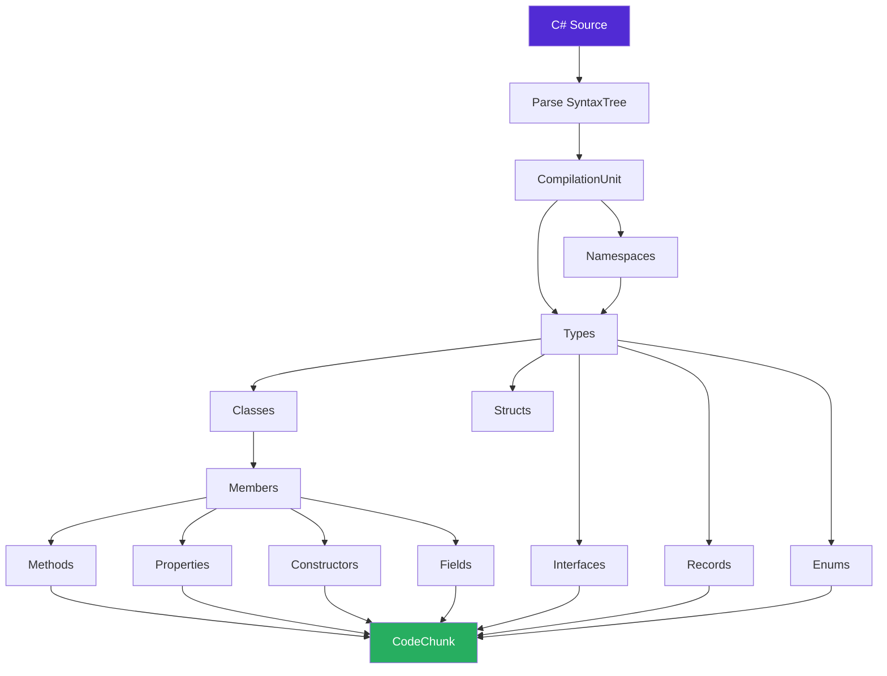
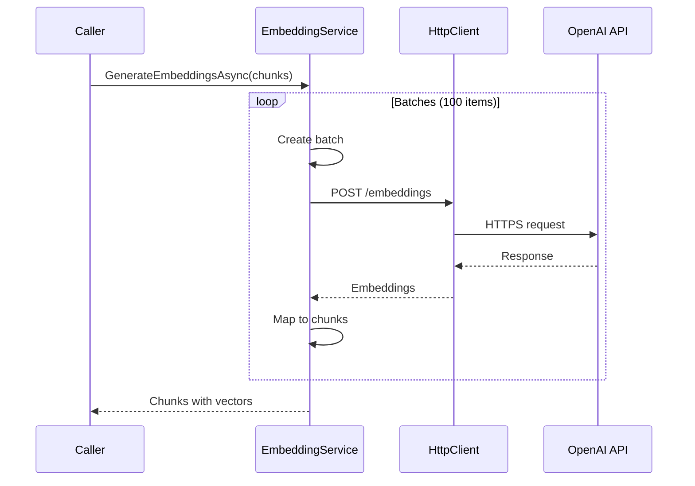
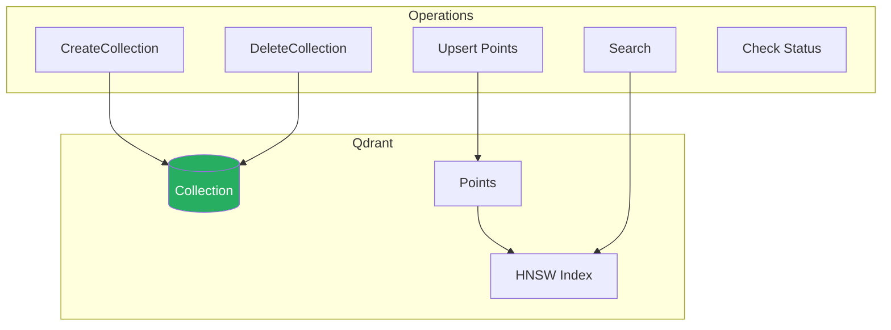
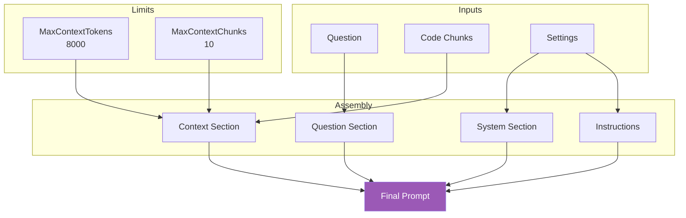
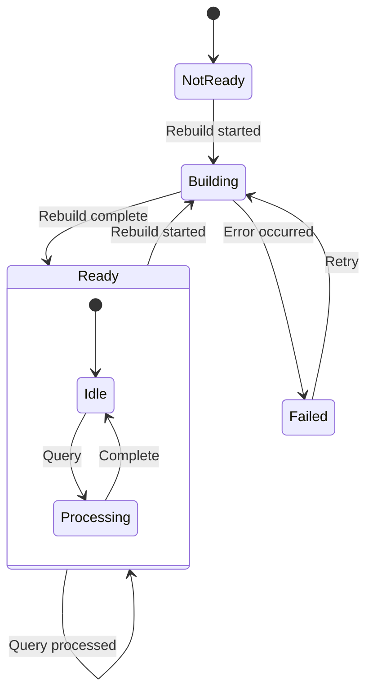
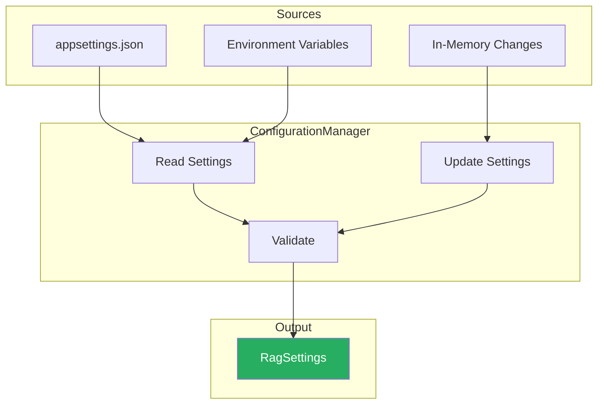
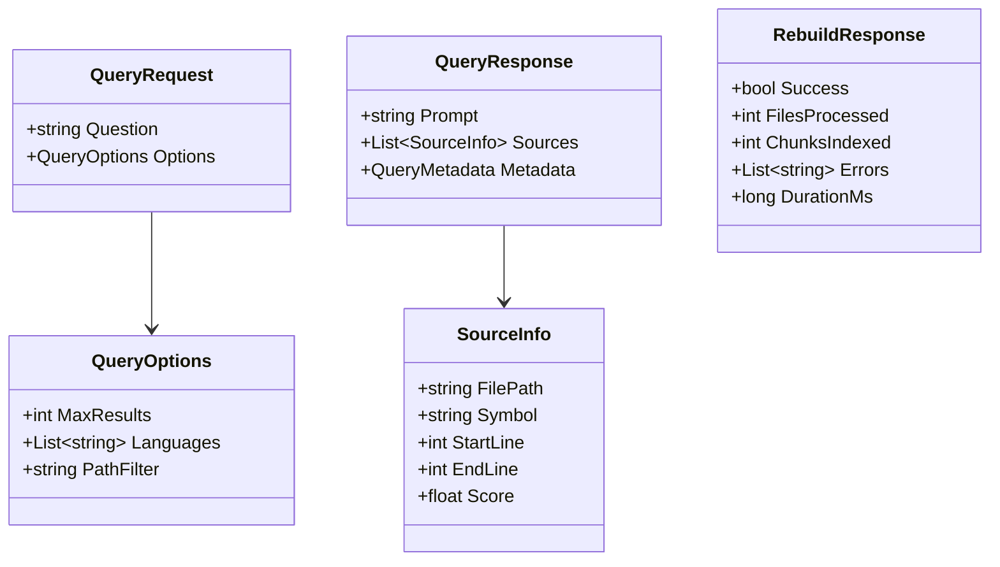

# Component Documentation

## Service Components

### Overview



---

## CodebaseScanner

Discovers and filters source code files in the codebase.

```mermaid
flowchart LR
    ROOT[/codebase] --> ENUM[Enumerate<br/>directories]

    ENUM --> FILTER{Apply<br/>filters}

    FILTER -->|Excluded folder| SKIP[Skip]
    FILTER -->|Hidden folder| SKIP
    FILTER -->|Excluded file| SKIP
    FILTER -->|Valid| OUTPUT[ScannedFile]

    subgraph "Excluded Folders"
        F1[bin]
        F2[obj]
        F3[node_modules]
        F4[.git]
        F5[dist]
    end

    subgraph "Excluded Patterns"
        P1[*.min.js]
        P2[*.min.css]
        P3[*.designer.cs]
        P4[*.generated.cs]
    end

    style ROOT fill:#3498db,color:#fff
    style OUTPUT fill:#27ae60,color:#fff
```

| Property | Description |
|----------|-------------|
| **Input** | Root path from configuration |
| **Output** | `IEnumerable<ScannedFile>` |
| **Filters** | Folders, patterns, extensions |

---

## ParserFactory

Routes files to appropriate parsers based on extension.



---

## CSharpParser

Uses Roslyn for accurate C# syntax analysis.



**Symbol Types Extracted:**
- `class` - Class header with signature
- `method` - Complete method with body
- `property` - Property with accessors
- `constructor` - Marked as `ClassName.ctor`
- `field` - Field declarations
- `interface` - Full interface definition
- `record` - Record definition
- `struct` - Struct with members
- `enum` - Enum with values

---

## JavaScriptParser

Pattern-based parsing for JavaScript/TypeScript files.

```mermaid
flowchart TB
    CODE[JS Source] --> PATTERNS[Apply Regex<br/>Patterns]

    PATTERNS --> FN[Function<br/>declarations]
    PATTERNS --> ARROW[Arrow<br/>functions]
    PATTERNS --> CLASS[Class<br/>definitions]
    PATTERNS --> EXP[Export<br/>statements]

    FN --> BRACE[Find matching<br/>braces]
    ARROW --> BRACE
    CLASS --> BRACE
    EXP --> BRACE

    BRACE --> EXTRACT[Extract<br/>complete block]

    EXTRACT --> DEDUP[Remove<br/>duplicates]

    DEDUP --> SORT[Sort by<br/>line number]

    SORT --> CHUNKS[CodeChunk[]]

    style CODE fill:#f7df1e,color:#000
    style CHUNKS fill:#27ae60,color:#fff
```

**Pattern Recognition:**
```
function name(...)     → function
const/let/var = () => → arrow_function
class Name             → class
export function/class  → export
module.exports         → module_export
```

---

## PlainTextParser

Fallback parser using sliding window technique.

```mermaid
flowchart LR
    TEXT[Text Content] --> SPLIT[Split by<br/>newlines]

    SPLIT --> ACC[Accumulate<br/>lines]

    ACC --> CHECK{Size ><br/>MaxChunk?}

    CHECK -->|Yes| YIELD[Yield chunk]
    CHECK -->|No| ACC

    YIELD --> OVERLAP[Keep last<br/>N lines]

    OVERLAP --> ACC

    ACC -->|EOF| FINAL[Yield remaining]

    YIELD --> CHUNKS[CodeChunk[]]
    FINAL --> CHUNKS

    style TEXT fill:#95a5a6,color:#fff
    style CHUNKS fill:#27ae60,color:#fff
```

| Setting | Default | Description |
|---------|---------|-------------|
| MaxChunkSize | 1500 | Characters per chunk |
| ChunkOverlap | 200 | Characters overlap |

---

## EmbeddingService

Converts text to vector embeddings via external API.



**Configuration:**

| Setting | Default | Description |
|---------|---------|-------------|
| Provider | OpenAI | API provider |
| BaseUrl | api.openai.com/v1 | Endpoint |
| Model | text-embedding-3-small | Model |
| Dimensions | 1536 | Vector size |
| BatchSize | 100 | Items per request |
| Timeout | 60s | Request timeout |

---

## QdrantVectorStore

Manages vector storage and similarity search.



**Collection Configuration:**
- **Vector Size:** 1536 dimensions
- **Distance Metric:** Cosine similarity
- **Storage:** Persistent volume

**Search Parameters:**
- Top K results (configurable)
- Optional language filter
- Optional path filter

---

## PromptBuilder

Assembles LLM-ready prompts from search results.



---

## IndexStatusService

Tracks indexing state and activity history.



**Tracked Data:**
- `IsReady` - Index availability
- `LastRebuildTime` - Timestamp
- `FilesProcessed` - Count
- `ChunksIndexed` - Count
- `Errors` - List of issues
- `ActivityLog` - Recent actions

---

## ConfigurationManager

Runtime configuration management.



---

## API Endpoints

```mermaid
flowchart LR
    subgraph "Health"
        H1[GET /health]
        H2[GET /health/ready]
    end

    subgraph "RAG"
        R1[POST /rag/rebuild]
        R2[POST /rag/query]
    end

    subgraph "Admin UI"
        A1[/admin]
        A2[/admin/settings]
        A3[/admin/indexstatus]
        A4[/admin/query]
    end

    H1 --> STATUS[Status Check]
    H2 --> READY[Readiness Check]

    R1 --> REBUILD[Index Rebuild]
    R2 --> QUERY[Code Search]

    A1 --> DASH[Dashboard]
    A2 --> CONFIG[Configuration]
    A3 --> INDEX[Index Details]
    A4 --> TEST[Query Testing]

    style H1 fill:#27ae60,color:#fff
    style H2 fill:#27ae60,color:#fff
    style R1 fill:#3498db,color:#fff
    style R2 fill:#3498db,color:#fff
    style A1 fill:#9b59b6,color:#fff
    style A2 fill:#9b59b6,color:#fff
    style A3 fill:#9b59b6,color:#fff
    style A4 fill:#9b59b6,color:#fff
```

---

## Request/Response Models


