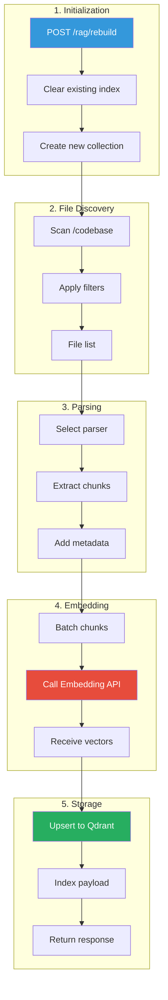
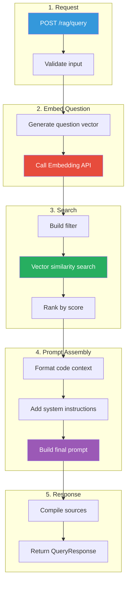
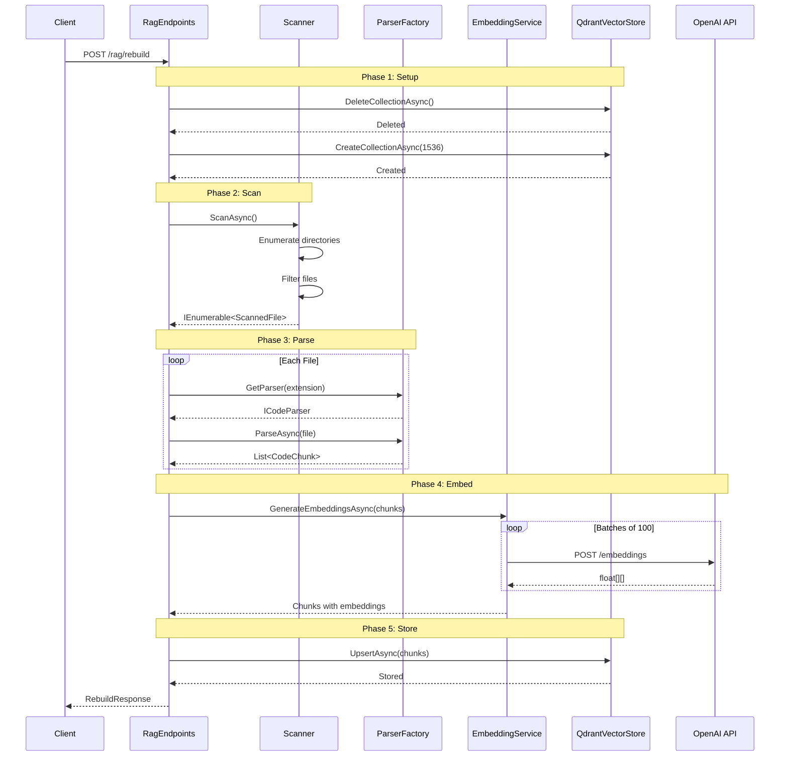
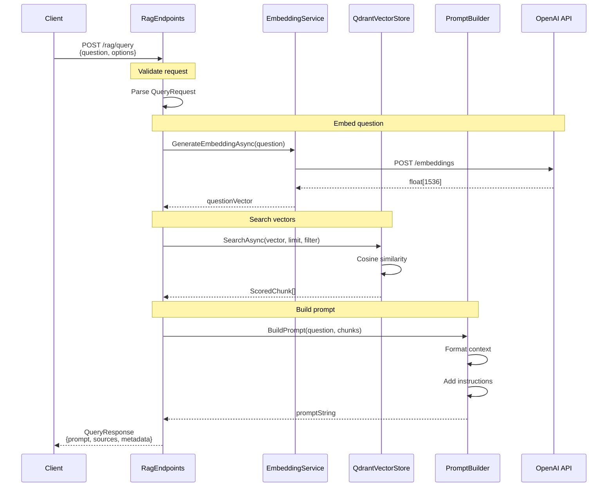
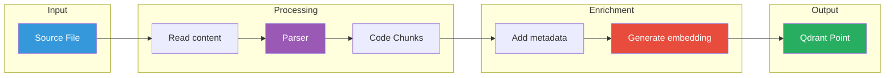
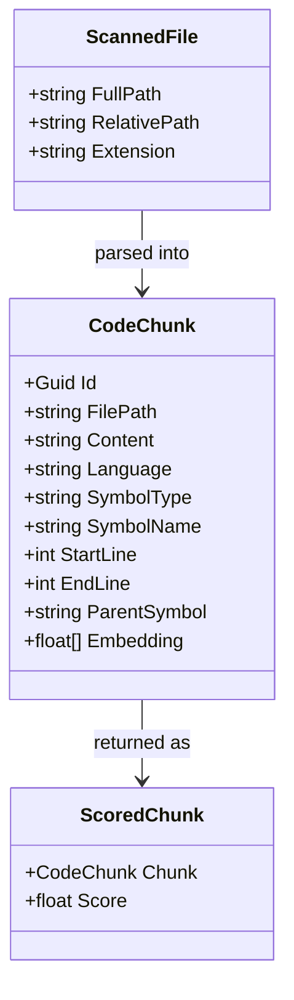
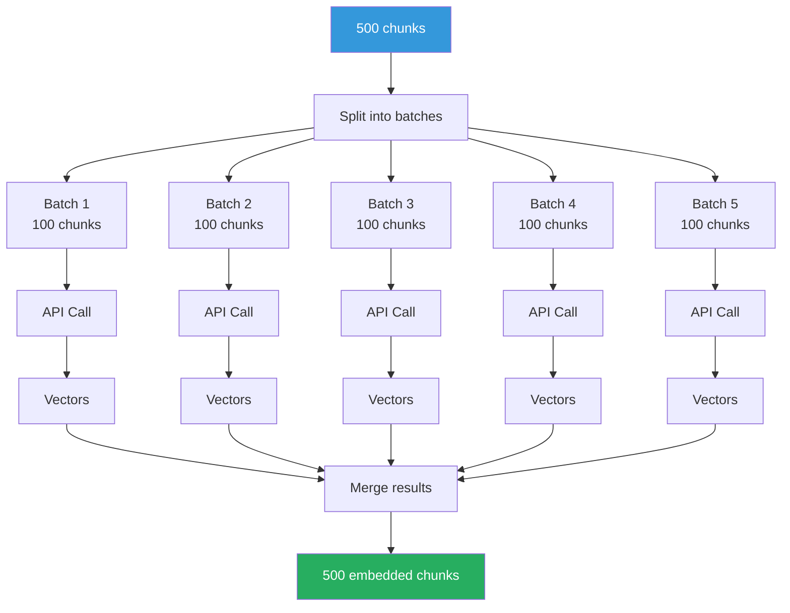
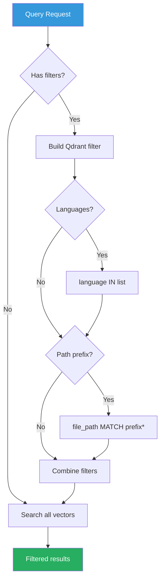
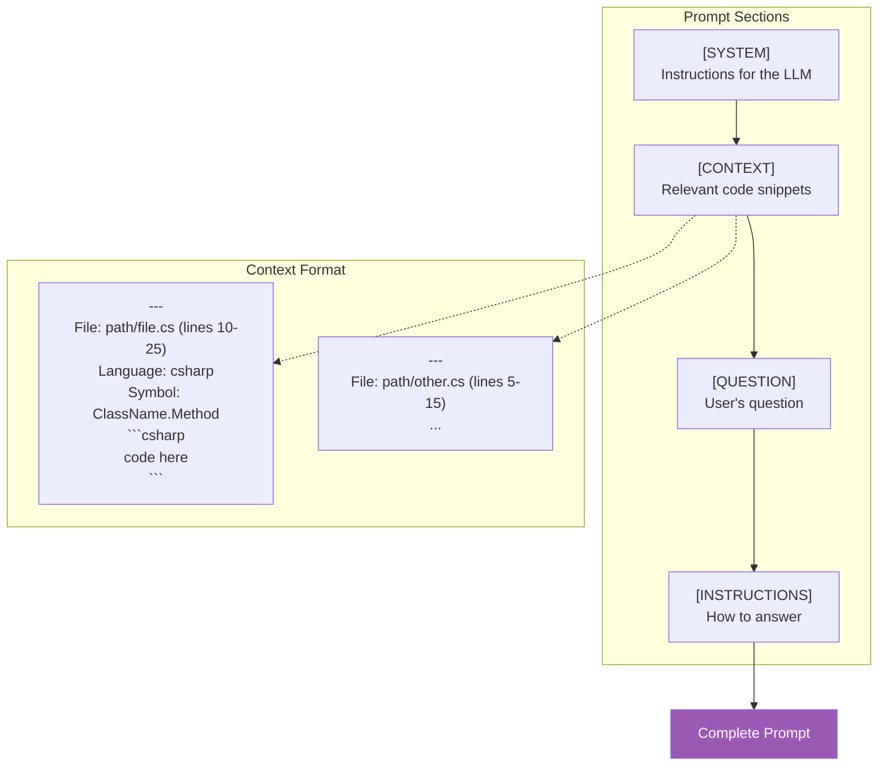
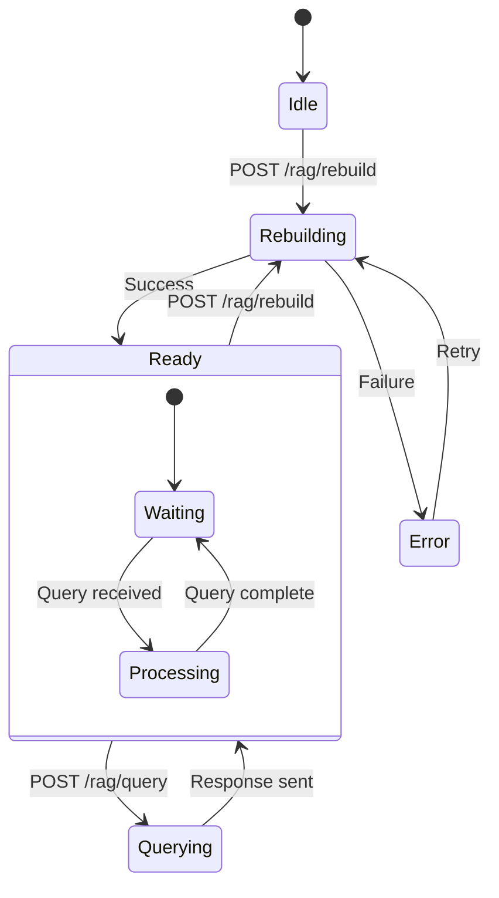

# Data Flow Documentation

## Index Rebuild Pipeline

The rebuild process transforms source code into searchable vector embeddings.

---

## Query Pipeline

The query process finds relevant code and builds an LLM-ready prompt.

---

## Detailed Rebuild Sequence

---

## Detailed Query Sequence

---

## File Processing Flow

---

## Chunk Data Model

---

## Embedding Batch Processing

---

## Search Filter Application

---

## Prompt Structure

---

## Activity Tracking

